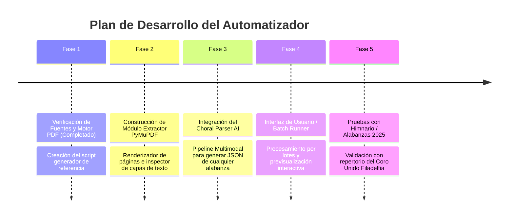

# Pipeline de Automatización: Partitura Coral a Hoja de Letra (Alabanzas)
> **IDDV El Buen Pastor — Coro Unido Filadelfia**  
> Documento de especificación técnica y arquitectura para el Agente IA Automatizador.

---

## 1. Visión General del Proyecto

El objetivo de este sistema es **automatizar la conversión de partituras corales en formato PDF (SATB: Soprano, Contralto, Tenor, Bajo)** exportadas de software de notación musical (Sibelius, MuseScore, Finale) a **hojas de letra limpias, estandarizadas y de alta fidelidad estética** en formato PDF de 1 página (y formatos complementarios para proyección).

### Caso de Estudio y Referencia ("Ground Truth")
* **Entrada:** `Con Gozo Cantemos a Cristo Partitura.pdf` (5 páginas, arreglo coral a 4 voces, con compases, silencios, repeticiones y casillas).
* **Salida Objetivo:** `Con Gozo Cantemos a Cristo Letra.pdf` (1 página, Letter, tipografía cuidada, respuestas entre paréntesis, distribución equilibrada).

---

## 2. Anatomía de los Documentos

### 2.1. Documento Fuente (Partitura Coral SATB)
1. **Encabezado y Metadatos:**
   * Título en caligrafía cursiva (*"Con Gozo Cantemos a Cristo"*).
   * Número de alabanza (*"03"*).
   * Autor/Arreglista (*"Absalón Núñez N"*).
   * Tempo / Métricas ($q=80$, $4/4$).
   * Pie de página institucional (*"Iglesia del Dios Vivo Columna y Apoyo de la Verdad 'El Buen Pastor' | CORO UNIDO Filadelfia | SANTA CENA 2025"*).
2. **Distribución Polifónica (4 Sistemas / Pentagramas):**
   * **Soprano:** Melodía principal continua en coros.
   * **Contralto y Tenor:** Armonía y respuestas intermedias.
   * **Bajo:** Línea base armónica, ecos y respuestas en contracanto.
3. **Notación de Texto Musical:**
   * Las palabras están **silabificadas con guiones** bajo cada figura (`con go-zo can-te-mos a Cris-to`).
   * Existen **ligaduras de elisión** representadas con guiones bajos o caracteres glifo (`que_ÉL`, `y_en`, `su_n-mor`).
   * Múltiples estrofas apiladas verticalmente bajo una sola línea melódica (Filas `1.`, `2.`, `3.`, `4.`).
   * Casillas de repetición (**Voltas**): Casilla `1,2,3,` y Casilla `4,`.

---

### 2.2. Documento Destino (Hoja de Letra)
1. **Geometría de Página:**
   * Formato: **US Letter** ($612.0 \times 792.0$ puntos tipográficos / $8.5 \times 11$ pulgadas).
   * Márgenes: Superior ~72 pt, Inferior ~100 pt, Márgenes laterales simétricos.
   * Alineación: **100% Centrado horizontal** en el eje $X = 306.0$ pt.
2. **Especificación Tipográfica:**
   * **Título:** `DancingScript-Bold` a **26.0 pt**.
   * **Encabezados de Sección y Letra:** `Economica-Regular` a **13.0 pt** (todo el cuerpo de letra en **MAYÚSCULAS**).
3. **Métricas de Espaciado:**
   * Interlineado estándar dentro de un bloque: **17.18 pt**.
   * Separación entre bloques/secciones: **34.36 pt** (exactamente 1 línea en blanco).
   * Distribución vertical calibrada para que el himno completo ocupe **exactamente 1 sola página**.

---

## 3. Matriz de Reglas de Transformación

Para transformar la partitura coral en la hoja de letra sin perder el sentido vocal ni la estructura del arreglo, el agente IA debe aplicar las siguientes 5 reglas de negocio musical:

### Regla 1: Des-silabificación y Unión de Palabras
* **Entrada en partitura:** `Con go-zo can-te-mos a Cris-to con go-zo can-te-mos a Cris-to`
* **Salida en letra:** `CON GOZO CANTEMOS A CRISTO CON GOZO CANTEMOS A CRISTO`
* Se deben unir las sílabas eliminando los guiones `-`, respetando los espacios entre palabras y pasando todo el texto de la alabanza a mayúsculas.

### Regla 2: Limpieza de Ligaduras y Glifos de Notación
En programas como Sibelius, las sinalefas (unión de vocales entre palabras) utilizan caracteres especiales de fuentes como *Opus Text* o guiones bajos:
* `que_ÉL` $\longrightarrow$ `PORQUE EL` / `QUE ÉL`
* `y_en` $\longrightarrow$ `Y EN`
* `so-lo_a Él` $\longrightarrow$ `SOLO A ÉL`
* `su_n-mor` (carácter de ligadura vocal de Sibelius) $\longrightarrow$ `SU AMOR`

### Regla 3: Detección y Envoltura de Respuestas Vocales `( ... )`
Las contestaciones cantadas por voces secundarias (ecos, refuerzos, contrapuntos) **deben encerrarse entre paréntesis**:

| Sección | Voz Líder | Voz Secundaria (Respuesta) | Resultado en Hoja de Letra |
| :--- | :--- | :--- | :--- |
| **Coro** | Soprano: *Con gozo cantemos a Cristo* | Contralto/Tenor/Bajo: *...Jesús* | `CON GOZO CANTEMOS A CRISTO (JESÚS)` |
| **Coro** | Soprano: *...con gozo cantemos a Cristo* | Otras voces (c. 4): *DIG-NO ES* | `CON GOZO CANTEMOS A CRISTO (DIGNO ES)` |
| **Coro** | Soprano: *...con gran regocijo* | Otras voces (c. 7): *CRIS-TO ÉL REY so-lo a Él* | `CON GRAN REGOCIJO (CRISTO EL REY, SOLO A ÉL)` |
| **Estrofas** | Tenor: *Con su sangre nos redimió...* | Bajo: *Oh, Dios... Oh Dios* | `...VIDA NOS DIO (OH, OH DIOS)` / `...(OH DIOS)` |
| **Estrofas** | Melodía común | Contralto/Tenor: *Nos redimió* | `...VIDA NOS DIO (NOS REDIMIÓ)` |
| **Estrofa 1** | Refrain común | Casilla 1: *hoy le rin-do a-do-ra-ción* | `ES POR ESO QUE SOLO A ÉL RINDO MI ADORACIÓN (HOY LE RINDO ADORACIÓN)` |
| **Estrofa 2** | Refrain común | Casilla 2: *hoy le can-to con fer-vor* | `ES POR ESO QUE SOLO A ÉL RINDO MI ADORACIÓN (HOY LE CANTO CON FERVOR)` |
| **Estrofa 3** | Refrain común | Casilla 3: *vi-ve en mi co-ra-zón* | `ES POR ESO QUE SOLO ÉL VIVE EN MI CORAZÓN (VIVE EN MI CORAZÓN)` |
| **Estrofa 4** | Refrain común | Casilla 4: *siem-pre quie-ro ser-le fiel* | `ES POR ESO QUE SOLO A EL FIEL YO SIEMPRE SERÉ (SIEMPRE QUIERO SERLE FIEL)` |
| **Final** | Soprano: *Él me salvó con su sangre carmesí* | Bajo (c. 28): *san-gre su sangre que es Carmesí* | `El ME SALVO CON SU SANGRE CARMESÍ (SU SANGRE QUE ES CARMESÍ)` |
| **Final** | Soprano: *y en la cruz demostró su amor por mi* | Bajo (c. 32): *tró su amor por tí y por mí* | `Y EN LA CRUZ DEMOSTRÓ SU AMOR POR MI (SU AMOR POR TI Y POR MI)` |
| **Final** | Todas las voces al unísono/acorde | *Jesús* | `JESUS` |

### Regla 4: Desempaquetado de Estrofas Múltiples (Strophes) y Casillas
1. En la partitura, las estrofas 1, 2, 3 y 4 están apiladas bajo el pentagrama del Tenor (compases 10–12).
2. El agente debe extraer cada número por separado:
   * Estrofa `1.` toma la línea 1 de texto.
   * Estrofa `2.` toma la línea 2 de texto.
   * Estrofa `3.` toma la línea 3 de texto.
   * Estrofa `4.` toma la línea 4 de texto.
3. Cada estrofa debe combinarse con:
   * Su primera respuesta de Bajo `(OH, OH DIOS)`.
   * El verso puente `ES POR ESO QUE SOLO A ÉL...` seguido de `(OH DIOS)`.
   * La repetición de la frase de estrofa acompañada del contracanto `(NOS REDIMIÓ / EL ES MI DIOS / ÉL YA VENCIÓ / YO LE HE DE VER)`.
   * La frase resolutiva de la casilla correspondiente:
     * Casilla 1 $\rightarrow$ `(HOY LE RINDO ADORACIÓN)`
     * Casilla 2 $\rightarrow$ `(HOY LE CANTO CON FERVOR)`
     * Casilla 3 $\rightarrow$ `(VIVE EN MI CORAZÓN)`
     * Casilla 4 $\rightarrow$ `(SIEMPRE QUIERO SERLE FIEL)`

### Regla 5: Estructura y Eliminación de Repeticiones Redundantes
* En la partitura aparece `CORO FINAL` en el compás 18 para indicar la vuelta al coro antes de la coda.
* En la hoja de letra:
  * El coro se imprime **una sola vez** al inicio (`CORO:`).
  * Le siguen las estrofas enumeradas (`1.`, `2.`, `3.`, `4.`).
  * Concluye con la coda (`FINAL:`).
* Esto garantiza concisión, máxima legibilidad y permite mantener el documento en **una página única**.

---

## 4. Esquema de Datos Intermedio (Song Data Contract)

Para desacoplar el análisis musical de la generación del PDF, el Agente IA debe producir un objeto JSON con la siguiente estructura:

```json
{
  "$schema": "http://json-schema.org/draft-07/schema#",
  "title": "SongLyricsStructure",
  "type": "object",
  "required": ["title", "sections"],
  "properties": {
    "title": { "type": "string", "example": "Con Gozo Cantemos a Cristo" },
    "author": { "type": "string", "example": "Absalón Núñez N" },
    "hymn_number": { "type": "string", "example": "03" },
    "sections": {
      "type": "array",
      "items": {
        "type": "object",
        "required": ["heading", "lines"],
        "properties": {
          "type": { "type": "string", "enum": ["CORO", "ESTROFA", "PUENTE", "FINAL"] },
          "heading": { "type": "string", "example": "CORO:" },
          "lines": {
            "type": "array",
            "items": { "type": "string" }
          }
        }
      }
    }
  }
}
```

### Ejemplo Concreto generado para *Con Gozo Cantemos a Cristo*:
```json
{
  "title": "Con Gozo Cantemos a Cristo",
  "author": "Absalón Núñez N",
  "hymn_number": "03",
  "sections": [
    {
      "type": "CORO",
      "heading": "CORO:",
      "lines": [
        "CON GOZO CANTEMOS A CRISTO (JESÚS) CON GOZO CANTEMOS A CRISTO (DIGNO ES)",
        "PORQUE EL ES DIGNO DE TODA HONRA DE TODA GLORIA Y HONOR",
        "CON GOZO TODOS UNIDOS CANTEMOS CON GRAN REGOCIJO (CRISTO EL REY, SOLO A ÉL)",
        "Y ENTRE SUS ATRIOS CON ALABANZA RINDAMOS ADORACIÓN"
      ]
    },
    {
      "type": "ESTROFA",
      "heading": "1.",
      "lines": [
        "CON SU SANGRE NOS REDIMIÓ, CON SU MUERTE VIDA NOS DIO (OH, OH DIOS)",
        "ES POR ESO QUE SOLO A ÉL RINDO MI ADORACIÓN (OH DIOS)",
        "CON SU SANGRE NOS REDIMIÓ, CON SU MUERTE VIDA NOS DIO (NOS REDIMIÓ)",
        "ES POR ESO QUE SOLO A ÉL RINDO MI ADORACIÓN (HOY LE RINDO ADORACIÓN)"
      ]
    },
    {
      "type": "ESTROFA",
      "heading": "2.",
      "lines": [
        "REY DE REYES EL ES MI DIOS, REY DE REYES MI REDENTOR (OH, OH DIOS)",
        "ES POR ESO QUE SOLO A ÉL RINDO MI ADORACIÓN (OH DIOS)",
        "REY DE REYES EL ES MI DIOS, REY DE REYES MI REDENTOR (EL ES MI DIOS)",
        "ES POR ESO QUE SOLO A ÉL RINDO MI ADORACIÓN (HOY LE CANTO CON FERVOR)"
      ]
    },
    {
      "type": "ESTROFA",
      "heading": "3.",
      "lines": [
        "ALELUYA PORQUE VENCIÓ, ALELUYA RESUCITÓ (OH, OH DIOS)",
        "ES POR ESO QUE SOLO ÉL VIVE EN MI CORAZÓN (OH DIOS)",
        "ALELUYA PORQUE VENCIÓ, ALELUYA RESUCITÓ ( ÉL YA VENCIÓ)",
        "ES POR ESO QUE SOLO ÉL VIVE EN MI CORAZÓN (VIVE EN MI CORAZÓN)"
      ]
    },
    {
      "type": "ESTROFA",
      "heading": "4.",
      "lines": [
        "CARA A CARA LE HE DE VER, CARA A CARA POR SIEMPRE AMÉN (OH, OH DIOS)",
        "ES POR ESO QUE SOLO A EL FIEL YO SIEMPRE SERÉ (OH DIOS)",
        "CARA A CARA LE HE DE VER, CARA A CARA POR SIEMPRE AMÉN (YO LE HE DE VER)",
        "ES POR ESO QUE SOLO A EL FIEL YO SIEMPRE SERÉ (SIEMPRE QUIERO SERLE FIEL)"
      ]
    },
    {
      "type": "FINAL",
      "heading": "FINAL:",
      "lines": [
        "El ME SALVO CON SU SANGRE CARMESÍ (SU SANGRE QUE ES CARMESÍ)",
        "Y EN LA CRUZ DEMOSTRÓ SU AMOR POR MI (SU AMOR POR TI Y POR MI)",
        "JESUS"
      ]
    }
  ]
}
```

---

## 5. Arquitectura del Agente Automatizador

El sistema se estructura en 4 módulos independientes:

```
[07] PDF ALABANZAS AUTOMATION/
├── fonts/                               # Fuentes requeridas descargadas
│   ├── DancingScript-Bold.ttf           # Tipografía oficial del título
│   ├── Economica-Regular.ttf            # Tipografía oficial de letra
│   └── Economica-Bold.ttf
├── src/
│   ├── extractor.py                     # Extracción de texto y renderizado de páginas
│   ├── choral_parser.py                 # Lógica de reconstrucción coral (AI Agent)
│   ├── pdf_generator.py                 # Motor de renderizado ReportLab (1 página)
│   └── exporter.py                      # Exportación a TXT, Markdown, ProPresenter
├── test/
├── partituras_input/                    # Carpeta para colocar PDFs de partituras
├── letras_output/                       # Carpeta donde se guardan los PDFs de letra
└── main.py                              # Punto de entrada CLI / automatizador
```

### Módulo 1: Extractor (`src/extractor.py`)
* Utiliza `PyMuPDF` (`fitz`) para:
  1. Extraer los flujos de texto vectorial con sus posiciones $(x, y)$ y tamaño de fuente.
  2. Detectar títulos, números y autores en la cabecera.
  3. Renderizar cada página como imagen PNG a 150/300 DPI para inspección visual de notas y pentagramas.

### Módulo 2: Choral Parser & AI Agent (`src/choral_parser.py`)
* Cuando la partitura es vectorial estándar, un parser heurístico analiza los pentagramas.
* Para resolver polifonía compleja, repeticiones cruzadas y casillas de forma 100% infalible, se utiliza el **Agente IA Multimodal**:
  * **Prompt del Sistema para el Agente:**
  ```text
  Eres un experto transcriptor coral de música cristiana (SATB). Tu labor es recibir
  las imágenes de una partitura coral y transformarla en una hoja de letra perfecta.
  
  Reglas estrictas:
  1. Des-silabifica todas las palabras eliminando guiones (ej. 'can-te-mos' -> 'CANTEMOS').
  2. Resuelve ligaduras musicales (ej. 'su_n-mor' -> 'SU AMOR', 'y_en' -> 'Y EN').
  3. Identifica todas las respuestas, ecos y refuerzos vocales de las voces secundarias
     (Contralto, Tenor, Bajo) y colócalas estrictamente entre paréntesis: (RESPUESTA).
  4. Desempaqueta las estrofas apiladas (1., 2., 3., 4.), asociando cada una con su
     correspondiente casilla de repetición (Voltas 1, 2, 3 vs Casilla 4).
  5. Omite la repetición literal de 'CORO FINAL' si el coro ya se especificó al inicio.
  6. Escribe todo el cuerpo de la letra en MAYÚSCULAS.
  7. Retorna ÚNICAMENTE un objeto JSON válido según el esquema SongLyricsStructure.
  ```

### Módulo 3: Motor de Renderizado PDF (`src/pdf_generator.py`)
* Utiliza `reportlab.pdfgen.canvas` con registro de fuentes TrueType (`DancingScript-Bold` y `Economica-Regular`).
* **Algoritmo de Auto-Fit Dinámico para 1 Página:**
  ```python
  def calculate_page_layout(sections, max_height=792.0, top_margin=72.0, bottom_margin=80.0):
      # Calcula la cantidad de líneas totales y espacios
      total_lines = sum(len(sec["lines"]) + (1 if sec.get("heading") else 0) for sec in sections)
      total_gaps = len(sections)
      
      available_height = max_height - top_margin - bottom_margin
      # Determina interlineado óptimo
      line_height = available_height / (total_lines + total_gaps)
      
      # Si excede el tamaño estándar (17.18 pt), se limita al estándar;
      # si es más largo, reduce suavemente entre 14pt y 17pt para no desbordar.
      line_height = min(17.18, max(13.5, line_height))
      return line_height
  ```

### Módulo 4: Exportadores Secundarios (`src/exporter.py`)
* Además del PDF idéntico, genera automáticamente:
  1. **`.txt` / `.md`**: Para archivo y cancioneros digitales.
  2. **`.pptx` / ProPresenter Slides**: Diapositivas preparadas por estrofa para el equipo audiovisual de la iglesia.

---

## 6. Hoja de Ruta para Implementación (Paso a Paso)



1. **Fase 1 (Completada):** Se descargaron las fuentes oficiales (`DancingScript-Bold.ttf`, `Economica-Regular.ttf`) y se validó que ReportLab genera un PDF idéntico al original en geometría y estilo.
2. **Fase 2:** Programar `src/extractor.py` y `src/pdf_generator.py` como módulos reutilizables y limpios.
3. **Fase 3:** Programar el pipeline de inferencia para conectar el PDF de entrada con la reconstrucción de texto coral en JSON.
4. **Fase 4:** Crear un comando CLI simple (ejemplo: `python process_partituras.py --input mis_partituras/ --output mis_letras/`) y una interfaz web local amigable donde se pueda arrastrar el PDF y editar si se desea un ajuste manual antes de descargar.

---

## 7. Registro de Archivos en el Entorno Local

| Archivo / Carpeta | Descripción |
| :--- | :--- |
| `fonts/DancingScript-Bold.ttf` | Fuente oficial de Google Fonts para títulos de alabanzas |
| `fonts/Economica-Regular.ttf` | Fuente oficial de Google Fonts para estrofas y respuestas |
| `fonts/Economica-Bold.ttf` | Variante negrita para encabezados de sección |
| `test_generate_letra.py` | Script de prueba que replica exitosamente el PDF `Con Gozo Cantemos a Cristo Letra.pdf` |
| `Con Gozo Cantemos a Cristo Letra_generated.pdf` | PDF de prueba generado localmente con ReportLab |
| `PROCESO_AUTOMATIZACION_PARTITURA_A_LETRA.md` | Este documento de especificación técnica |
